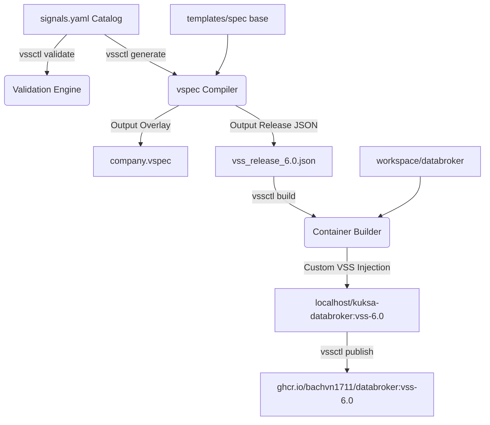

# Vehicle Signal Specification Tool (vssctl) - Complete Handbook

Welcome to the **vssctl Handbook**. This document serves as the comprehensive user and developer guide for `vssctl`, an automation tool designed to manage Vehicle Signal Specification (VSS) catalogs, generate overlaid metadata, build customized Eclipse KUKSA Databroker containers, and automate container publishing.

---

## 1. Introduction & Architecture

`vssctl` bridges the gap between automotive application developers and Eclipse KUKSA Databroker administration. Instead of manually editing large, nested `.vspec` tree definitions and executing custom toolchains, developers declare custom signals in a simple catalog. The tool automatically handles compilation, signal inheritance syncing across VSS releases, container image generation, and registry pushes.

### Core Architecture Flow



---

## 2. Workspace & Folder Structure

For `vssctl` to operate correctly, your workspace should be organized as follows:

```
workspace/
├── catalog/
│   └── signals.yaml            # Custom signals definition catalog (single source of truth)
├── templates/
│   ├── spec/                   # Official baseline VSS specs (VehicleSignalSpecification.vspec)
│   └── vss-core/               # Legacy release baseline JSON files (vss_release_2.0.json, etc.)
├── generated/
│   ├── company.vspec           # Generated custom company overlay spec
│   ├── vss_release_6.0.json    # Compiled main metadata output (custom + baseline)
│   └── json_tree/              # Legacy JSON releases with synchronized custom signals
└── databroker/
    └── kuksa-databroker/       # Local clone of the Eclipse KUKSA Databroker repository
```

---

## 3. Installation & Getting Started

### Prerequisites
- **Python 3.10+** (tested up to 3.11; `python3` on Linux).
- **Git** (required to clone the KUKSA Databroker repository for `vssctl build`).
- **Container engine** (Podman or Docker) — required only for the `build`/`publish` commands.
  - *Linux note:* Podman runs rootless by default. If using Docker, ensure your user is in the `docker` group to run commands without `sudo`:
    ```bash
    sudo usermod -aG docker $USER
    newgrp docker
    ```

### What Gets Installed

`vssctl` is a Python package. Besides the CLI itself, it needs the official COVESA `vspec` compiler (provided by the `vss-tools` package) to run `vssctl generate`. Install everything through the requirements files:

| File | Contents | Required for |
|---|---|---|
| `requirements.txt` | Runtime libraries (`typer`, `rich`, `pyyaml`, `pydantic`, `jinja2`, `textual`, `vss-tools`) | Every command |
| `requirements-dev.txt` | `-r requirements.txt` + `pytest` | Running the test suite only |

> **Important:** A plain `pip install -e .` installs only the packages declared in `pyproject.toml` and will **not** provide the `vspec` compiler. Always install `requirements.txt` as well, otherwise `vssctl generate` fails with a missing `vspec` executable.

### Local Setup

#### On Windows:
1. Create and activate a Python virtual environment:
   ```bash
   python -m venv .venv_win
   .\.venv_win\Scripts\activate
   ```
2. Upgrade pip and install all runtime dependencies (includes the official `vspec` compiler):
   ```bash
   python -m pip install --upgrade pip
   pip install -r requirements.txt
   ```
3. Install the `vssctl` package itself (registers the `vssctl` CLI command):
   ```bash
   pip install -e .
   ```
4. (Optional) Install development dependencies to run the test suite:
   ```bash
   pip install -r requirements-dev.txt
   ```
5. Verify the installation and environment:
   ```bash
   vssctl doctor
   ```

#### On Linux:
1. Install Python virtualenv and system dependencies (Debian/Ubuntu example):
   ```bash
   sudo apt-get update
   sudo apt-get install python3-pip python3-venv git
   ```
2. Create and activate a Python virtual environment:
   ```bash
   python3 -m venv .venv
   source .venv/bin/activate
   ```
3. Upgrade pip and install all runtime dependencies (includes the official `vspec` compiler):
   ```bash
   python3 -m pip install --upgrade pip
   pip install -r requirements.txt
   ```
4. Install the `vssctl` package itself (registers the `vssctl` CLI command):
   ```bash
   pip install -e .
   ```
5. (Optional) Install development dependencies to run the test suite:
   ```bash
   pip install -r requirements-dev.txt
   ```
6. Verify the installation and environment:
   ```bash
   vssctl doctor
   ```

---

## 4. CLI Command Reference

`vssctl` exposes a clean click/typer-based command structure. Below is the usage syntax and parameters for every subcommand.

### Global Options
All commands support the following global parameters:
- `--config <path>`: Specify a path to a custom `.vssctl.yaml` config file.
- `--verbose, -v`: Enable verbose logging and outputs.
- `--quiet, -q`: Suppress standard logs and print only success/fail indicators.

---

### `vssctl doctor`
Checks the local development environment for required runtimes.
- **Verification Target:** Python environment, `vspec` compiler executable, container runtimes (`podman` or `docker`), and local workspace paths.
- **Usage:**
  ```bash
  vssctl doctor
  ```

---

### `vssctl signal`
Command group to manage the custom catalog signals directly from the CLI.

#### `list`
Lists all custom signals currently declared in `workspace/catalog/signals.yaml`.
```bash
vssctl signal list
```

#### `add`
Interactively prompts for properties (node type, parent path, name, datatype, unit, description) to append a new signal to the catalog.
```bash
vssctl signal add
```

#### `remove`
Deletes a custom signal from the catalog based on its parent path and name.
```bash
vssctl signal remove --parent "Vehicle.Cabin" --name "DoorCount"
```

#### `search`
Search custom catalog signals matching a specific keyword.
```bash
vssctl signal search "Speed"
```

---

### `vssctl validate`
Validates all signals in `workspace/catalog/signals.yaml` for VSS rules.
- **Rules checked:**
  - Capitalization: Node names must start with an uppercase letter and use CamelCase.
  - Parents: Node must reside under the `Vehicle` branch.
  - Data types: Data type must be a VSS-supported type (e.g. `uint8`, `float`, `boolean`).
  - Units: Units must match official VSS units if defined.
  - Duplication: Checks if signals are duplicated.
- **Usage:**
  ```bash
  vssctl validate
  ```

---

### `vssctl generate`
Overlays custom catalog signals onto the baseline spec tree, compiles it, and syncs custom entries.
- **Arguments:**
  - `--version <text>`: Target release version to compile. Default: `6.0`.
- **Logic:**
  1. Loads `workspace/catalog/signals.yaml` and parses the tree.
  2. Generates `workspace/generated/company.vspec` matching custom branches.
  3. Merges the base spec in `workspace/templates/spec` with `company.vspec` and invokes the official `vspec` exporter.
  4. Generates the main metadata release file at `workspace/generated/vss_release_<version>.json`.
  5. Scans `workspace/templates/vss-core` and automatically synchronizes custom catalog signals across all legacy versions in `workspace/generated/json_tree/`.
- **Usage:**
  ```bash
  vssctl generate --version 6.0
  ```

---

### `vssctl build`
Builds a customized KUKSA Databroker container image baking in the generated VSS JSON metadata.
- **Arguments:**
  - `--vss-file, -f <path>`: Path to the generated VSS JSON file. Defaults to latest generated if omitted.
  - `--tag, -t <text>`: Output image tag. Default format: `kuksa-databroker:vss-<version>`.
  - `--engine <text>`: Container engine choice (`auto`, `docker`, or `podman`).
  - `--databroker-dir <path>`: Path to KUKSA Databroker repository root. Defaults to `workspace/databroker`.
  - `--no-cache`: Standard cache bypass flag passed to container build engine.
  - `--publish, -p`: Enable direct publishing to GHCR after a successful build.
- **Build Optimization (Fast Path vs. Source Compile):**
  - **Fast-path:** The builder inspects `workspace/databroker/kuksa-databroker/dist/` or `target/release/` for pre-built binaries. If found, it copies the binary directly to skip compilation.
  - **Source Compile Fallback:** If no binary is found, a multi-stage `Dockerfile.vssctl` is generated utilizing `rust:1-slim`, installing native packages (`protobuf-compiler`, `cmake`, `make`, `g++`), and compiling the cargo binary from source inside the container.
- **Usage:**
  ```bash
  vssctl build -f workspace/generated/vss_release_6.0.json --engine podman
  ```

---

### `vssctl publish`
Tags and pushes local Databroker images to GitHub Container Registry (GHCR).
- **Arguments:**
  - `--image, -i <text>`: Local image tag to publish.
  - `--remote-tag, -t <text>`: Remote tag to push (defaults to matching the local version tag). Full registry URIs are supported.
  - `--token <text>`: GitHub PAT with `write:packages` scope.
  - `--username <text>`: GitHub account owner. Default: `bachvn1711`.
  - `--engine <text>`: auto, docker, or podman.
  - `--skip-login`: Skip authentication check/login step (uses existing host credentials).
- **Authentication Fallbacks:** The CLI will check the `--token` parameter, then the `GHCR_TOKEN` environment variable, then the `CR_PAT` environment variable.
- **Usage:**
  ```bash
  vssctl publish -i localhost/kuksa-databroker:vss-6.0 -t vss6.0 --skip-login
  ```

---

### `vssctl pipeline`
Executes the entire local flow in a single step. Useful for daily development.
- **Workflow:** `Validate` -> `Generate` -> `Build` -> `(Optional) Publish`.
- **Arguments:** Supports all options from `validate`, `generate`, `build`, and `publish`.
- **Usage:**
  ```bash
  vssctl pipeline --publish --skip-login --engine podman
  ```

---

### `vssctl completion`
Generates auto-completion shell scripts for the command-line console.
- **Arguments:**
  - `shell`: Target shell (bash, zsh, or fish).
- **Usage:**
  ```bash
  vssctl completion bash > ~/.vssctl-completion.bash
  source ~/.vssctl-completion.bash
  ```

---

### `vssctl browse`
Opens an interactive terminal UI (Textual) to explore the signal catalog as a tree.
- **Arguments:**
  - `--source <base|custom|merged>`: Which catalog view to browse. Default: `merged`.
- **Usage:**
  ```bash
  vssctl browse
  vssctl browse --source custom
  ```
- **Note:** Requires an interactive terminal (`stdin`/`stdout` TTY).

---

## 5. Configuration File Specification

You can configure default tool settings by adding a `.vssctl.yaml` file to your project root.

```yaml
# Configuration schema for vssctl

workspace:
  # Path to the cloned KUKSA Databroker repository (relative or absolute)
  databroker_path: "workspace/databroker"
  
  # Directory where compilation output files are written
  output_dir: "workspace/output"

defaults:
  # Container engine to execute image builds and publication.
  # Options: auto (detects podman first), podman, docker
  engine: "auto"
  
  # GitHub organization or user space under which packages reside
  ghcr_org: "bachvn1711"
  
  # Default version tag to target for JSON and image tags
  vss_version: "6.0"
```

---

## 6. CI/CD Release Pipeline (GitHub Actions)

The repository includes a GitHub Actions configuration at `.github/workflows/release.yml` that automates packaging and deployment.

### Workflow Triggers
- Push to the `main` or `master` branch.
- Push to version tags matching `v*.*.*`.
- Manual execution via the **Run workflow** button (workflow_dispatch).

### Pipeline Stages
1. **Checkout & Setup:** Clones the repository recursively (including git submodules) and sets up Python 3.11.
2. **Testing:** Installs dependencies and runs `pytest tests/`. If any test fails, the pipeline aborts.
3. **Validation & Compilation:** Runs `vssctl validate` to check the catalog, then compiles the production specification for VSS version 6.0 (`vss_release_6.0.json`).
4. **Containerization (GHCR):** Configures Docker Buildx, authenticates to the GitHub Container Registry using `secrets.GITHUB_TOKEN`, builds the databroker image, and pushes it to `ghcr.io/bachvn1711/databroker:<ref_name>`.
5. **Asset Attachment:** If triggered by a release tag, a new GitHub Release is created, and the generated VSS JSON schemas are attached as direct release downloads.

---

## 7. Customizing Registry & Organization Settings

When adopting `vssctl` for a different team or organization (e.g. migrating from `bachvn1711` to your custom organization), you must update the registry pathways in the following locations.

### A. Local Default Settings (`.vssctl.yaml`)
To change the default organization for all local build and publish runs, modify the `defaults.ghcr_org` setting in your local `.vssctl.yaml` file:
```yaml
defaults:
  ghcr_org: "your-custom-org-or-username"
```
Once set, any push commands without explicit usernames will target `ghcr.io/your-custom-org-or-username/databroker`.

### B. Command Line Parameter Overrides
You can override the target registry path dynamically on the command line using the `--username` option or by supplying a full URI to the `--remote-tag` option:
```bash
# Push to a custom user package repository
vssctl publish -i localhost/kuksa-databroker:vss-6.0 --username my-custom-user

# Push to a completely different container registry
vssctl publish -i localhost/kuksa-databroker:vss-6.0 --remote-tag registry.example.com/org/databroker:latest
```

### C. CI/CD Release Automation (.github/workflows/release.yml)
To change where the GitHub Actions pipeline pushes packages, edit the **Build and Push Databroker Container to GHCR** step inside [.github/workflows/release.yml](file:///d:/Work/CODE/AUTONXT_AI\vssctl\.github\workflows\release.yml):
```yaml
      - name: Build and Push Databroker Container to GHCR
        env:
          GHCR_TOKEN: ${{ secrets.GITHUB_TOKEN }}
        run: |
          IMAGE_TAG="${{ github.ref_name }}"
          IMAGE_TAG=$(echo "$IMAGE_TAG" | sed 's/\//-/g')
          
          vssctl build \
            -f workspace/generated/vss_release_6.0.json \
            -t ghcr.io/<your-org-or-username>/<your-package-name>:$IMAGE_TAG \
            --publish \
            --username <your-org-or-username> \
            --token "$GHCR_TOKEN" \
            --engine docker
```
Ensure you replace `<your-org-or-username>` and `<your-package-name>` with your actual registry target names.

---

## 8. Best Practices & Troubleshooting

### Best Practices for Adding Signals
- **CamelCase:** Ensure all nodes start with an uppercase letter and use CamelCase (e.g., `AutoPilot` instead of `autopilot` or `Auto_Pilot`).
- **Description:** Provide descriptive definitions for all signals. Descriptions are parsed and baked directly into the Databroker JSON schema.
- **Actuators vs. Sensors:**
  - Writable commands (like HVAC temperatures, locks, throttle commands) should be defined with `writable: true` in the catalog. This maps them to **actuators** in the compiled spec.
  - Read-only statuses (like vehicle speeds, battery charge, sensor readings) should be defined with `writable: false` (or omit the field). This maps them to **sensors**.

### Troubleshooting Common Issues

#### 1. Cmake missing or Protobuf error during Docker Build
* **Symptom:** `failed to execute command: No such file or directory (os error 2) is cmake not installed?`
* **Resolution:** Ensure you are using `rust:1-slim` or newer in the builder. If you modified `build.py`, verify `cmake` is in the `apt-get` packages list.

#### 2. Git Symlinks resolving as text on Windows
* **Symptom:** `protoc failed: Could not make proto path relative: proto/kuksa/val/v1/val.proto: No such file or directory`
* **Resolution:** This happens because Git symlink files (like `databroker-proto/proto`) are checked out as text files containing `../proto/`. `vssctl build` automatically detects and replaces this file with a real folder clone during container construction, but if building manually, replace the symlink file with a copy of the actual `proto` directory.

#### 3. CP1252 character map crash on Windows Command Prompt
* **Symptom:** `UnicodeEncodeError: 'charmap' codec can't encode character '\u2713'...`
* **Resolution:** Avoid printing unicode symbols (like checkmarks `✓`) directly to stdout, as legacy Windows Command Prompt configurations fail to map them. Use ASCII alternatives.
